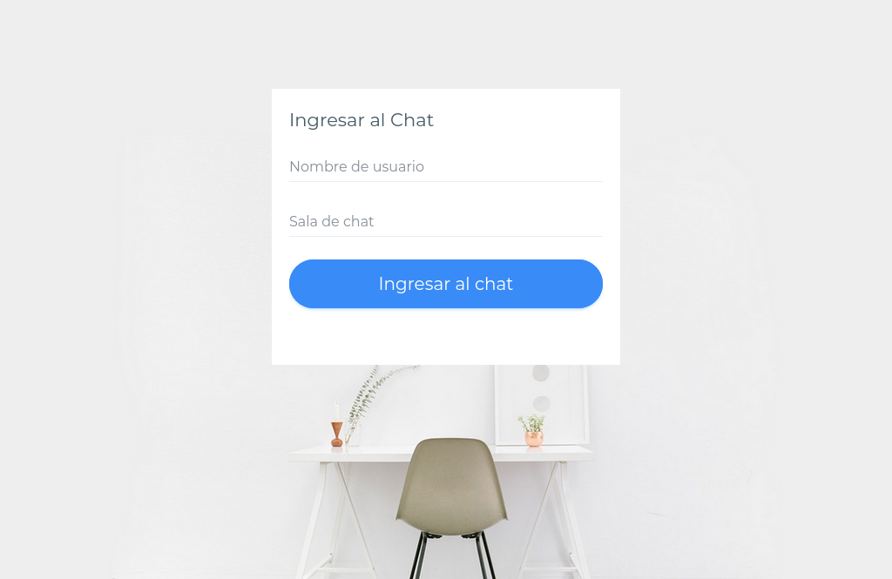
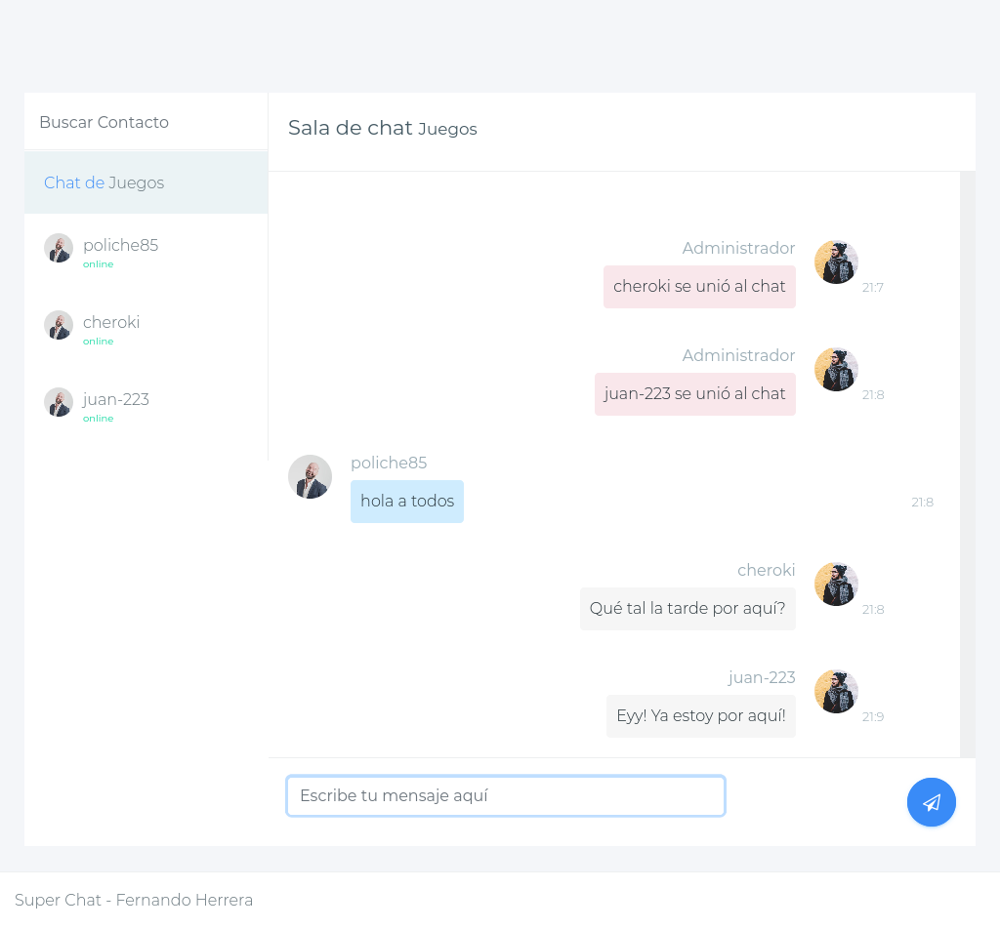

# Socket - Chat

---
## What is Socket - Chat? 🤔

We are talking about a chat application that allows communication with other users. It is built using socket communication with NodeJS.

---
## Notes:

Note:

* server-client communication
* client-server communication
* client-clients communication (Pending implementation of graphic mode)

---
## Installation 🔧
Remember that you must rebuild the node modules with the command

```
npm install
```

Start app with the command:
```
node server/server.js
```
By default the app runs in: [http://localhost:3000/](http://localhost:3000/).

---
## Technologies used 🛠️
- HTML
- CSS
- JavaScript
- NodeJS
- Sockets
- Express
- Visual Studio Code
- Git/Git Hub
- Heroku
---

## Some working samples ⚙️


***

---
***

## Do you want to see the application running? 🚀

Coming soon...

---